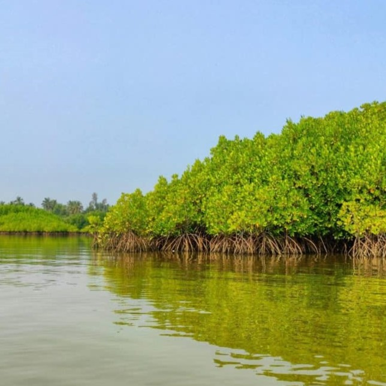
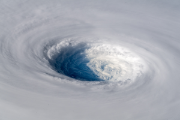

# Research interests
Coastal ecosystems are vital for climate risk mitigation and adaptation, yet these ecosystems themselves are among the most vulnerable to the impacts of climate change. My research centres on the question: **How does the resilience of these ecosystems to climate change affect their functioning under such pressures?** I am also passionate about developing new Earth and data science methodologies to deepen our understanding of coastal ecosystem dynamics and their functions at regional and global scales.

---
 # Research highlights
 
[The Magic of Mangrove](https://www.youtube.com/watch?v=2gAxHTHOSKk) 
  A three-minute video showcasing how I analyze historical storm data and satellite imagery to investigate how mangroves respond to storm events.
 
 
 
 
 
 

[Who defends the defenders?](https://www.esa.org/blog/2023/09/29/tropical-cyclones-pose-risk-to-mangroves/)
  A five-minute read exploring how mangroves may respond to increased storminess in a warming climate.
 
 
 
 
 
 
 

---

# Research focuses
**NbS for storm protection.** Coastal ecosystems serve as Natural-based Solutions (NbS) for storm protection, yet they remain highly vulnerable to storm disturbances. I am currently leading a research line to deepen our understanding of their sustainability and functionality amidst climate change by modeling the storm resilience of global mangrove ecosystems. This groundbreaking research has delivered the first global systematic analysis of storm risks to mangroves and uncovered potential significant regional shifts under future climate scenarios ([Mo et al., 2023, Front. Ecol. Environ.](https://esajournals.onlinelibrary.wiley.com/doi/10.1002/fee.2650)). This research has been funded by a _Government of Ireland Postdoctoral Fellowship_ (2022-2024) and a _Marie Curie Postdoctoral Fellowship_ (2020-2022). [Find out more](https://github.com/moyu-ENV/CoastNet)
  _Key outputs:_ Global storm attributes derived from historical records from 1980-2020 (at 1 degree). [View and download data](https://code.earthengine.google.com/a015ac987033c1af7a351c0efc6c6043) 
  
 
 
**Blue carbon dynamics.** Coastal marshes play a vital role as blue carbon sinks, helping to mitigate climate change by storing large amounts of carbon. However, these ecosystems face mounting threats from climate change and human- activities. My research focuses on uncovering the impacts of these disturbances on blue carbon dynamics using long-term satellite and field-based environmental data. One significant finding is that, despite being subjected to various climate and human-induced disturbances(e.g., [Mo et al., 2017, Ecosphere](https://esajournals.onlinelibrary.wiley.com/doi/10.1002/ecs2.1811)[Mo et al.,2017. Remote Sens.](https://www.mdpi.com/2072-4292/9/6/547)), coastal marshes in Louisiana, US, have shown the potential to contribute to climate mitigation by extending their growing seasons from 1984-2014 ([Mo et al., 2019 Ecol. Evol.](https://doi.org/10.1002/ece3.5215)). [Find out more](https://github.com/moyu-ENV/Dissertation2017) 
 _Key outputs:_ A non-linear mixed model for analysing time series data with complex patterns, such as phenological records. [View and download code](https://github.com/moyu-ENV/Dissertation2017) 
 
 
**Global electricity network resilience.** This research investigates the escalating vulnerability of electricity infrastructure to the increasing storm risks driven by climate change. By integrating satellite-based nighttime light observations, global electricity network databases, and historical and climate projections, it provides a comprehensive assessment of storm-induced intensity and duration disruptions to electricity systems. This work received funding from  NERC and the Oxford John Fell Fund. [Find out more](https://github.com/moyu-ENV/powerOutageNL)
 
 

---

# Recent publications
Y. Mo, M. Simard, J. W. Hall. Tropical cyclone risk to global mangrove ecosystems: potential future regional shifts. Frontiers in Ecology and the Environment (2023) 21(6): 269–274. doi:10.1002/fee.2650. [Access via publisher](https://esajournals.onlinelibrary.wiley.com/doi/full/10.1002/fee.2650) 
 Y. Mo, M. S. Kearney, R. E. Turner. The resilience of coastal marshes to hurricanes: the potential impact of excess nutrient. Environmental International (2020) 138: 105409. doi:10.1016/j.envint.2019.105409. [Access via pulisher](https://www.sciencedirect.com/science/article/pii/S0160412019312814#:~:text=Because%20excess%20nutrient%20can%20reduce,the%20marshes'%20susceptibility%20to%20hurricanes.)

---

# Teaching 
**AI for the Environment: Adaptation & infrastructure.**  University of Oxford. 2024. This course introduces the application of AI and ML in finding solutions for more resilience infrastructures in the face of climate change. [Resources](https://github.com/moyu-ENV/Teaching/tree/main/TCD-ZOU33070) 
**Experimental Design and Analysis.** Trinity College Dublin. 2022. This course focuses on the planning, implementation, and interpretation of experiments in environmental studies. It encompasses techniques for structuring experiments, minimizing bias, and applying statistical methods to analyze data effectively. [Resources](https://github.com/moyu-ENV/Teaching/tree/main/TCD-ZOU33070)
